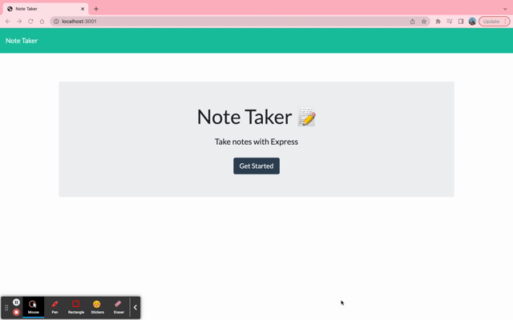

# Note Taker

  ### Description
  
  This application is a simple note taker that can be used to write and save notes. The note taker uses an Express.js back end that saves and retrieves note data from a JSON file.

  ## Table of Contents

  - [Built With](#built-with)
  - [Installation](#installation)
  - [Usage](#usage)
  - [Credits](#credits)
  - [Contact](#contact)
  - [License](#license)

  ## Built With

  - Javascript
  - Node.js
  - Express.js

  ## Installation
  
  Below is an example of how you can download the project onto your own device:

  1. Clone the repository using this link: 
      ```md
          git clone https://github.com/squrpe/note-taker.git
      ```

  You will need to download the suitable extensions for these to run the application in the command line.
  
  2. Install the node modules needed for the project within the terminal
      ```md
          npm install
      ```

  ## Usage

  Below is an example of the program:

  

To use the program, click the 'Get Started' button and you will then be directed to the notes page. To create a new note, simply click the '+' button in the top right and to save that note click the save button, also located in the top right. You will be able able to delete certain notes by clicking on the trash can icon located next to the notes located in the left coloumn.

  To host it via your personal device by using node.js in the command line, prompt the server file with
      ```md
          npm start
      ```
  
  ## Credits
  
  Base Code & Project Idea: The University of Adelaide Coding Bootcamp
  
  ## Contact
  
  Lara Nicole - [grockelara@gmail.com](grockelara@gmail.com)
  
  Project Link - https://github.com/squrpe/note-taker
  
  ## License
  
  Distributed under the MIT License. See LICENSE.txt for more information.
